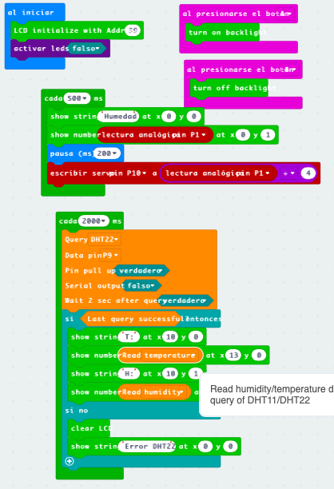

[v1 los botones encienden 
leds](https://makecode.microbit.org/_XoChXwfF12HJ)

[v2 funciones sin extensión 
maqueen](https://makecode.microbit.org/_PvpeE5gtCRfu)

Vemos cómo retirar extensiones/paquetes que no usamos

* Javascript -> Explorador

Similar al linkado

[V3 autoapagado](https://makecode.microbit.org/_hcuAMWasM12a)

## Movimientos maqueen

Definimos las funciones de movimiento:

* Adelante
* Atrás
* Derecha
* Izquierda 
* Parar

Calibramos tiempos para giros de 90 grados y movimientos de 50 cm

## Led de maqueen con botones

## Eliminar extensiones o componentes no utilizados

1. Cambiamos a código Javascript

2. Pulsamos en explorar

3. Podemos eliminar las que tienen el icono de la papelera

4. Se elimina la extensión

## Pines micro:bit

[Detalles sobre los pines](https://makecode.microbit.org/device/pins)

[Más detalles sobre los pines](https://tech.microbit.org/hardware/edgeconnector/)

Hay pines digitales, analógicos, PWM, comunicaciones...

### Encender led de maqueen (P8) con pulsador A (P5)
 
Con eventos:
 

Polling

Uno con polling otro con eventos

## Apagamos los leds pasados 5 segundos

Usamos una variable

## Ejemplos

* Radio: rover, coreografía
* Funciones: control maqueen, "librerias"
* Variables: medida de sensores. Dado con imágenes
* Termostato: intervalos, ventilador
* Ultrasonido: sigueme, personalidades

## Sesión 2

* Maqueen funciones
* Dado en grupo usando radio
* Control de maqueen por radio

## Sesión 3

### Kit avanzado

[Kit avanzado](https://tienda.bricogeek.com/microbit/1686-starter-kit-sensores-37-en-1-para-microbit.html)

[Wiki del kit](https://wiki.keyestudio.com/KS0361(KS0365)_keyestudio_37_in_1_Starter_Kit_for_BBC_micro:bit)

[Extensor](https://tienda.bricogeek.com/microbit/1706-keyestudio-shield-para-sensores-v2-para-microbit.html)

Conexión de componentes: 

* pulsador
* lcd
* servo
* sensor de temperatura

[Ejemplo con LCD y sensores](https://makecode.microbit.org/_D0wECTdkHMK5)

