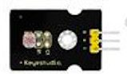

# Ejemplos

* Dado con imágenes -> variables
* Dado con imágenes en grupo -> funciones
* Pinout
* Termostato: leds en P8 y P12 
* Termostato: ventilador

## Usos de pines

### Sensores analógicos

La mayoría de sensores analógicos que usamos se basan en genera un voltaje proporcional a la medida que queremos determinar. Con la micro:bit mediremos el voltaje que hay entre los pines GND y S del sensor, almentándolo también con GND y V. Normalmente funcionan a 3V.

Para leerlos usaremos el bloque "lectura analógica" que nos da un valor entre 0 y 1023, correspondiente a 0V y a 3V

**Sensor de temperatura PTC**

**Sensor con medida lineal de temperatura LM35**, medimos el voltaje y con una sencilla operación determinamos la temperatura

**Sensor de humedad de suelo** nos permite medir la humedad del suelo midiendo la conductividad entre sus dos "patitas" al introducirlo en la tierra

**Sensor de nivel de agua o de lluvia** dependiendo de la candidad de agua que toque sus pistas produce una señal diferente 

**Sensor de nivel de luz** que nos da un voltaje proporcional al nivel de luz recibida. No está calibrado y la medida no tiene una medida concreta.

### Actuadores

**Relé** permite controlar cargas eléctricas de potencia (2500W en el caso de este) electrónicamente

Funciona digitalmente

Los **servos** son motores que incluyen la electrónica necesaria para controlar su movimiento. Suelen permitir un movimiento angular limitado a unos 180 gracos.

Para controlarlos usaremos una extensión que nos proporciona bloques para establecer su posición.

Las **pantallas LCD** nos permiten mostrar datos de una manera muy sencilla. La conexión es entre los pines SDA y SCL de la pantalla y los 19 y 20 de la microbit.

Para controlarla usaremos la extenxión **I2CLCD**, recordando que debemos inicializarla añadiendo el bloque "LCD inicialize" indicando la dirección de nuestra pantalla, que nos proporcionará el fabricante (suele ser una de estas 0x27, 0x3E, 0x3F)

### Salida "analógicas" - PWM

Aunque la micro:bit no tiene salidas analógicas reales, podemos simularlas en algunos pines, de manera que si conectamos un LED  a uno de los pines ¿P0, P1, P2, P3, P4 o P10? podemos conseguir modular su brillo

Para ello usaremos el módulo "Escritura analógica" indicando una "potencia" o "brillo" para el led entre 0 y 1023, 0 significa totalmente apagado y 1023 sería máximo brillo.

En este sencillo programa hacemos un ciclo de brillo creciente (Fade in) y luego uno decreciente (Fade out)

Se ha limitado hasta 100 para ver más claramente el cambio de brillo, si subimos cerca de los valores máximo el ojo ya no distingue el cambio.

Este tipo de control de potencia se llama PWM (Pulse Width Modulation), y consigue controlar la cantidad de energía transferida modulando el estado de pin con una cierta frecuencia, creando un pulso cuyo ancho es proporcional a la potencia que queremos transmitir

Como vemos en la imagen, cuando más tiempo está la señal en estado alto, es mayor el brillo del led.

**Led de potencia (3W)** se trata de un led de ilumninación de los que se usan en las bombillas LED que incluye en el módulo toda la electrónica necdesaria para que un pin de la micro:bit pueda controlar su brillo
