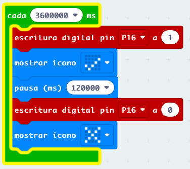

## Proyectos

### Riego v1 - Temporización

Sistema de control de riego más sencillo, simplemente se activa cada cierto tiempo y con una duración concreta.

Es tan sencillo que se podría hacer sólo con electrónica

### Riego v2 - Medida de humedad

En esta versión determinamos la humedad del suelo y si está por debajo de cierto valor encendemos el riego

Lo apagaremos cuando se alcance el valor de humedad establecido.

Para determinar estos valores de humedad (umbrales) hacemos un proceso de calibración en situaciones reales

### Iluminación

Es totalmente equivalente al anterior pero usando un sensor LDR y un LED para iluminar

### Calefacción

